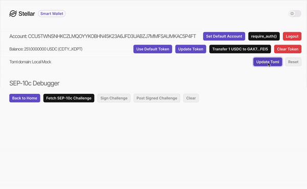

# sep-smart-wallet

> [!WARNING]  
> This code is for demonstration purposes only and has not been audited. Do not use it to store, protect, or secure assets or accounts on a public network.

A passkey-based smart wallet that interacts with SEP-10c (alpha) and SEP-24 protocols.

## Getting Started

### Prerequisites

- Node.js 20.x or higher
- [stellar-cli]
- (optional) Docker, for deploying the test anchor

### Installation

The following commands use Yarn, but you can use npm if you prefer:

```sh
yarn install
yarn dev
```

### Deploying a Test Anchor

To interact with the SEP-10c and SEP-24 protocols, you need a test anchor. Follow these steps to deploy one:

1. Clone the [java-stellar-anchor-sdk](https://github.com:stellar/java-stellar-anchor-sdk) repository on the `feature/m24-demo` branch:

    ```sh
    git clone -b feature/m24-demo git@github.com:stellar/java-stellar-anchor-sdk.git
    ```

2. Build the project using Docker:

   ```sh
   docker build --build-arg BASE_IMAGE=gradle:7.6.4-jdk17 -t anchor-platform:local ./
   ```

3. Run the project with Docker Compose:

   ```sh
   docker compose -f service-runner/src/main/resources/docker-compose.yaml up -d
   ```

### Communicating Bwtween the Wallet and the Anchor

To connect the wallet to the anchor, configure the TOML address in the wallet’s frontend to point to the domain serving the stellar.toml file of the anchor. If you’re using the test anchor, the URL will be `http://localhost:8080`.

Refer to the following GIF for a visual guide on configuring the TOML URL:



### Soroban Contracts

#### If You Are Reading this Before December 10th 2024

The code included here relies on contracts deployed to the Stellar testnet network and will be available for a limited time, unytil the next testnet reset (scheduled for December 10th 2024).

#### If You Are Reading this After December 10th 2024

If you try to run it after that date, you'll need to redeploy the contracts, which is explained in the [soroban](./soroban/README.md) directory and can be done easily through the `Makefile` included on that directory.

After deploying the contracts and retrieving the updated values for `WEBAUTHN_FACTORY` and `WEBAUTHN_WASM`, use these values to update the `.env` file by setting the `VITE_PASSKEY_CONTRACT_FACTORY` and `VITE_PASSKEY_CONTRACT_WALLET_WASM` variables, as demonstrated in the [`.env.example`] file.

[stellar-cli]: https://developers.stellar.org/docs/build/smart-contracts/getting-started/setup#install-the-stellar-cli
[`.env.example`]: ./.env.example
